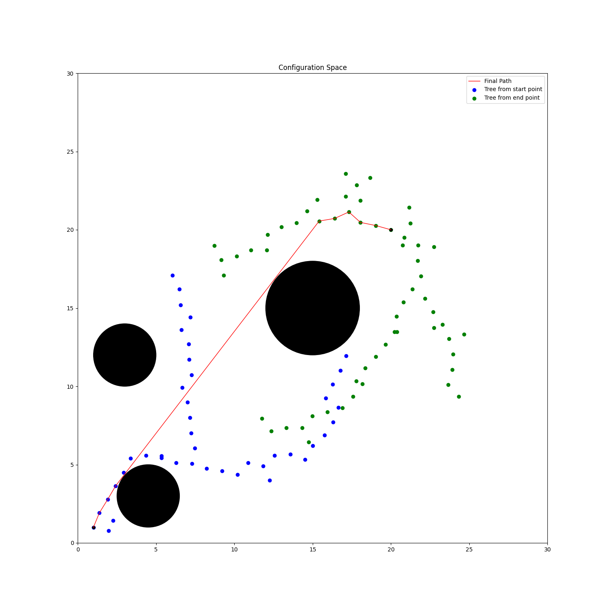
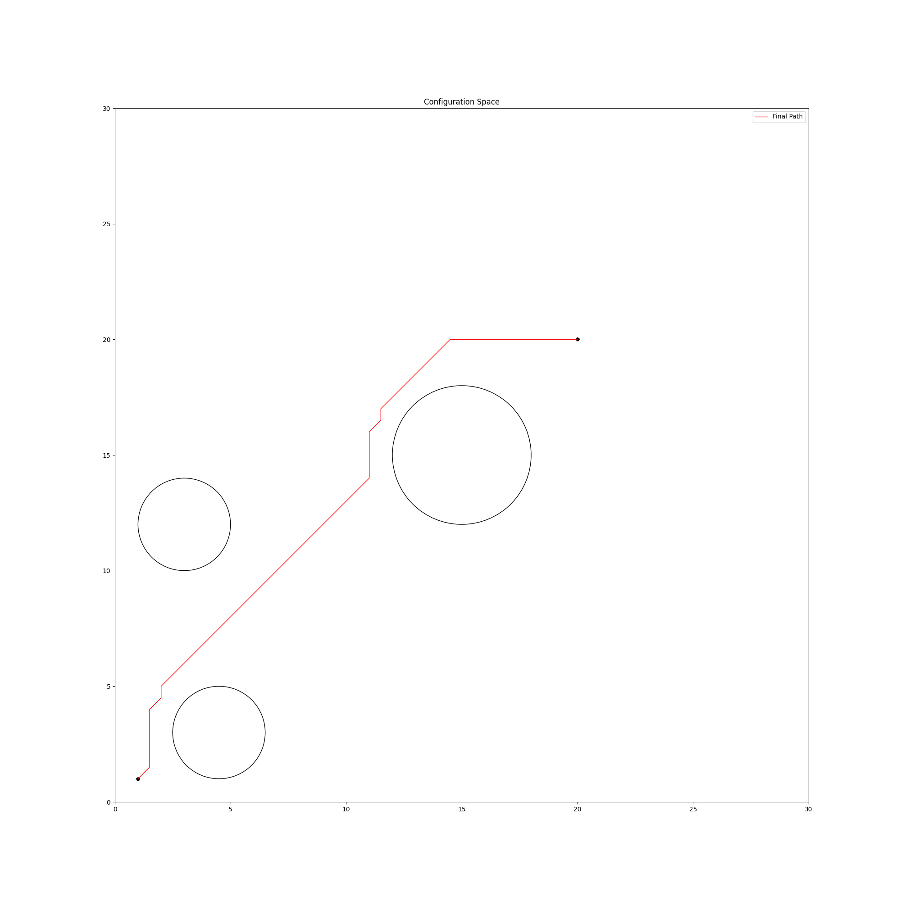

# Path planning algorithms

### Visualization using Streamlit

```bash
streamlit run app.py
```


### Bi-RRT
Creates random trees simulatneously from both, the start and goal.
```
usage: bi_rrt.py [-h] [-i ITER]

Bi-Directional RRT

optional arguments:
  -h, --help            show this help message and exit
  -i ITER, --iter ITER  Number of iterations (integer); Default=100
```



### APF (Artificial Potential Function)
Assigns a potential value to each cell in the grid which is the sum of the attractive
and repulsive potential strengths.

```
usage: pf.py [-h] [-g GRID] [-f FUNCTION] [-a ATTRACTIVE] [-r REPULSIVE]

Artificial Potential Function

optional arguments:
  -h, --help            show this help message and exit
  -g GRID, --grid GRID  Grid size; Default=0.5
  -f FUNCTION, --function FUNCTION
                        Attractive Potential function(p=paraboloid, c=conical); Default=c
  -a ATTRACTIVE, --attractive ATTRACTIVE
                        Attractive Potential Gain; Default=1
  -r REPULSIVE, --repulsive REPULSIVE
                        Repuslive Potential Gain; Default=5000
```


