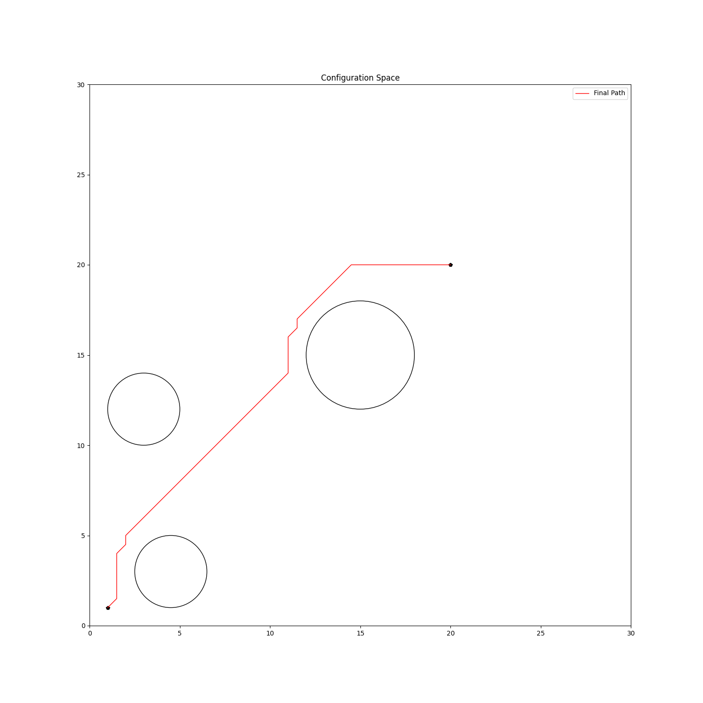

# path planning algorithms
 
## Bi-RRT
Creates random trees simulatneously from both, the start and goal.

## APF
Assigns a potential value to each cell in the grid which is the sum of the attractive 
and repulsive potential strengths.

